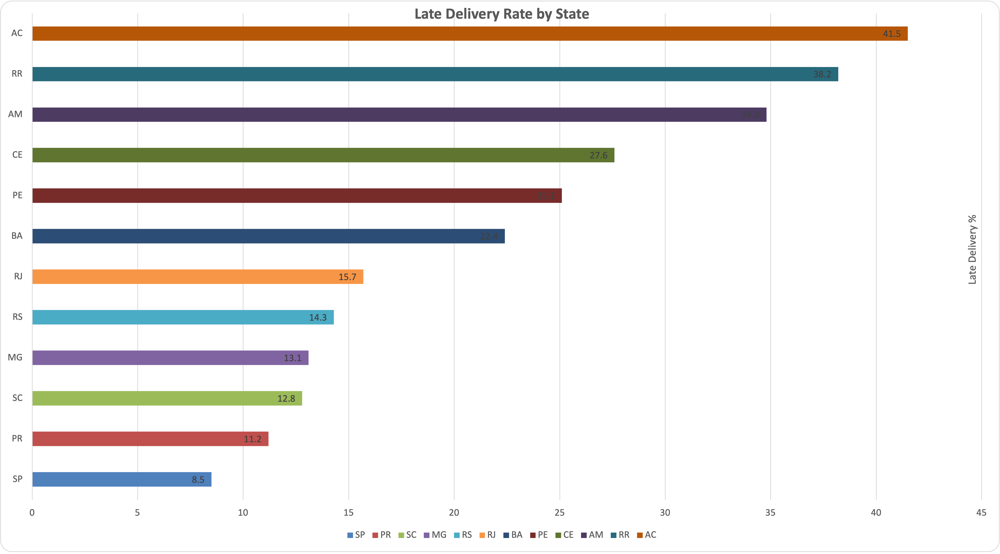
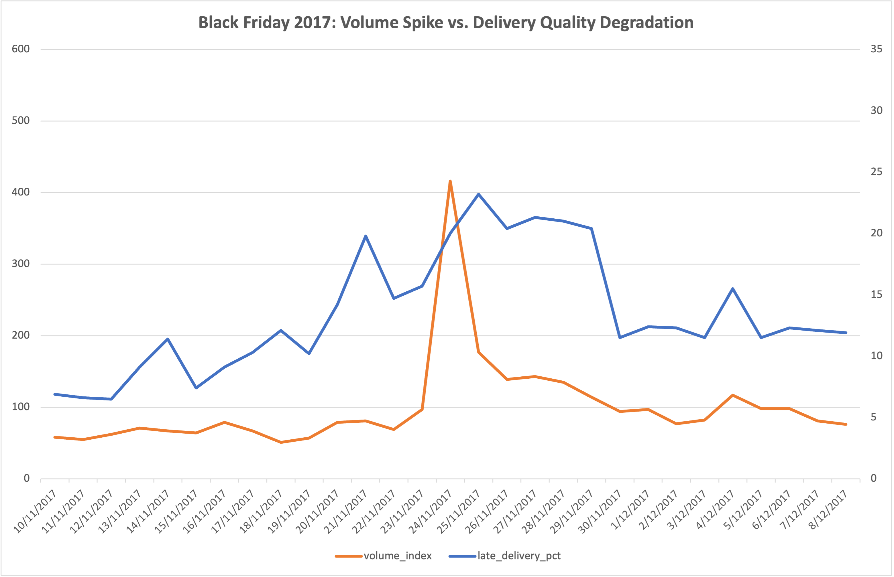
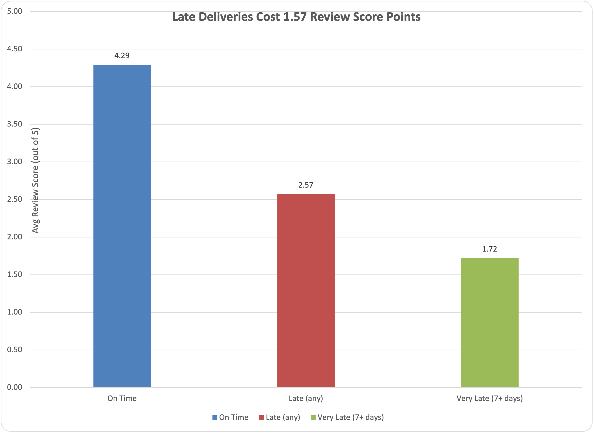
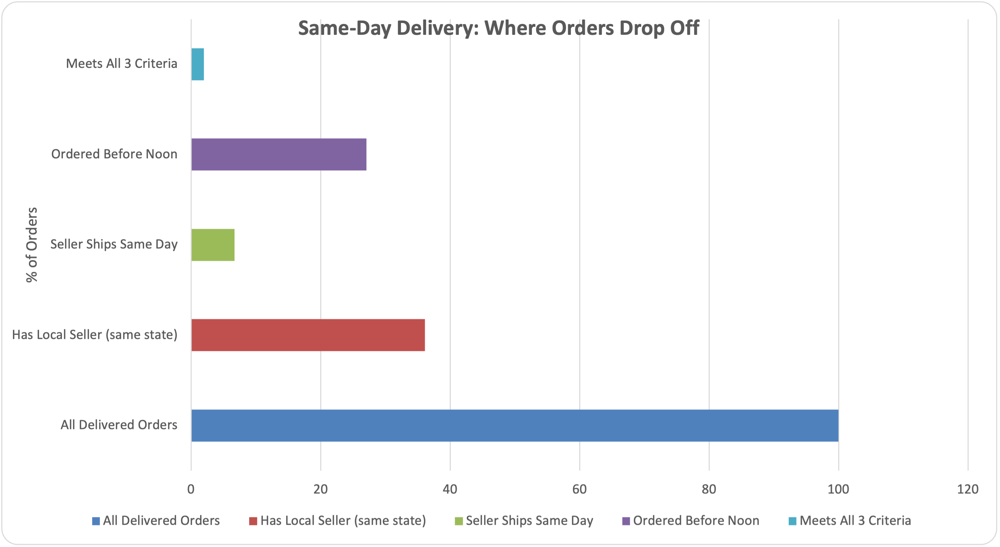

# olist-delivery-analysis

# E-Commerce Delivery Performance Analysis
**Dataset:** Olist Brazilian E-Commerce (100k orders, 2016–2018)  
**Tools:** SQL (SQLite), Excel  
**Purpose:** Portfolio project demonstrating demand analytics and 
logistics operational insight.

## Key Findings

**1. Regional delivery gap**  
Remote states deliver 2–3× slower than metro hubs, with late delivery 
rates exceeding 30% — compared to under 10% in São Paulo.

**2. Peak campaign → service degradation**  
Order volume spiked ~3× during Black Friday 2017. The average delivery time 
increased by 1-3 during the peak days, and the late delivery rate jumped from 6.9% to 23.2% in the week following the peak.

**3. Late delivery costs review score points**  
On-time orders average 4.29 stars. Late orders average 2.57 stars. 
Orders arriving 7+ days late average 1.72 stars — a 2.42 point drop compared to on-time orders, which directly impacts seller ratings and repeat purchase rates.

**4. Same-day delivery is a seller behaviour problem**  
36% of orders have a geographically local seller. Only 6.7% of sellers 
ship on the same day an order is placed. Buyer order timing (27% before 
noon) is not the constraint — seller first-mile SLA compliance is. 
Fixing seller handoff speed, not network expansion, is the highest-
leverage intervention for same-day rollout.

---

## Queries
| File | Business Question |
|---|---|
| 01_regional_performance.sql | Which regions have the worst delivery times and late rates? |
| 02_peak_event_degradation.sql | Does service quality degrade during volume spikes? |
| 03_category_late_rates.sql | Which product categories are highest risk during peak season? |
| 04_review_score_vs_delivery.sql | What is the customer satisfaction cost of a late delivery? |
| 05_same_day_eligibility.sql | What % of orders could qualify for same-day delivery? |

---

## Data Source
Olist Brazilian E-Commerce Dataset — Kaggle  
https://www.kaggle.com/datasets/olistbr/brazilian-ecommerce  
*(Data not included in this repo — download directly from Kaggle)*
